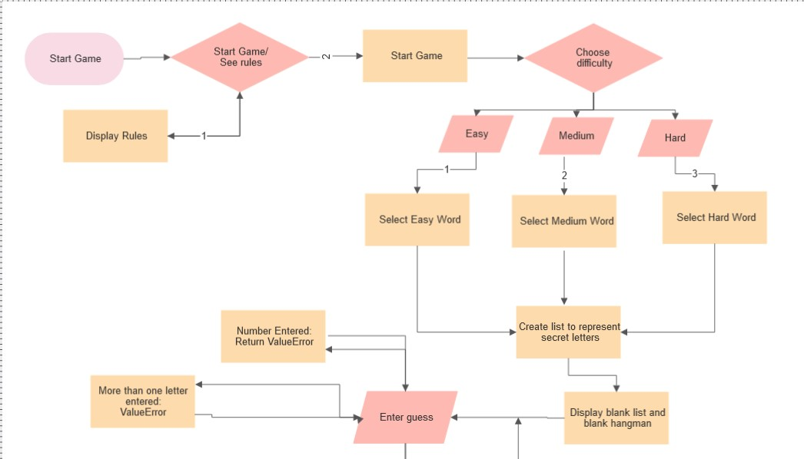
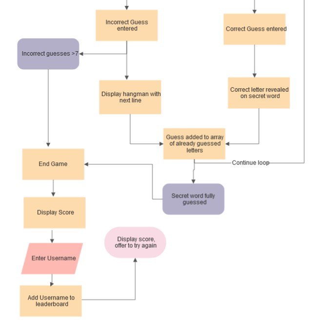
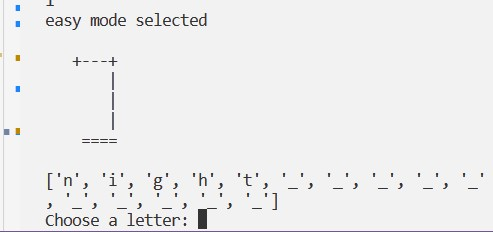
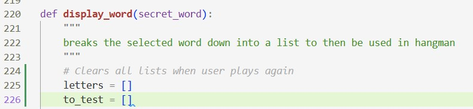

# Hangman Python Game

This project is a simple hangman game created in python

[Live Link]()

## Contents

- [Flowcharts](#Flowcharts)
- [User Experience](#User-Experience)
    -[User Interface](#user-interface)
- [Project Goals](#project-goals)

## FlowCharts
 

## User Experience

### User Stories

- As a user I want to play a hangman game
- As a user I want to read the rules and be able to understand the game 
- As a user I want to be able to change the difficulty if I find something too hard or easy
- As a user I want the program to respond to my input
- As a user I want accurate and straightforward feedback when I enter input

## Project Goals

- As the site owner I want the user to have a fun experience.
- As the site owner I want the game to be functional with no bugs or errors.

## Features

### ASCII art 

- The game feautures various peices of ASCII art throughout

- The opening page has A picture of Alcatraz prison which sets the users up for the game they're going to play 

- The hangman art iterates on an incorrect answer, providing clear feedback to users on how their guesses are being scored

### Leaderboard

- The leaderboard shows the title, and the top three scores, if the users' score is higher than the others, it replaces them.

### Rules page

- The page is accessed from the main menu, and shows the rules for the game in an easy to read way for the users

### Entry Page

- The entry page is the 'main hub' for the game, it allows the user to branch out

### Difficulty selector

- This page allows the user to pick from three different difficulty levels, each of which accesses a different list of words for the user to guess.

### Main game page

- This page is the main display for the game loop. It prints out the array for the hidden word and the hangman picture. 

- The secret word list changes on input, and the display generates a list of letters that have already been tested 

## Bug Fixes

### Secret word not matching the user input

The secret word is being split into a list, however the input is not being matched up to the correspinding letter in the list.

### Letters from previous games not being erased on new game iteration

This error was due to the lists containing guesses and the secret word being defined before the intitial game loop, so they are never cleared to allow the player to add new guesses

This error was easily fixed by moving the list assignmnets into the game loop

### Game not automatically ending on a correct answer

- handled by iterating through to_test, and testing if _ remained

## Testing

[Testing document here](testing.md)

## Technology used

### Languages

- This project was developed using the CI python template which already has HTML, CSS and JavaScript developed

- I added all Python

#### Python Frameworks

-  Gspread
- Oauth2
- Random

### Other technologies

 - [Flowcharts from Diagrams.net](https://app.diagrams.net/)
 - Google sheets
 - Google APIs
 - GitHub 
 - Git version control
 - Am I responsive 
 - GitPod for development
 - Heroku 

 ## Development
 
 Cloning, Forking and Deployment
