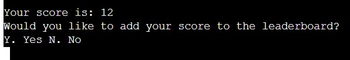
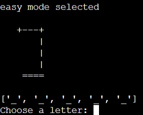

# Hangman Python Game

 [Live Link](https://amy-lewis-hangman.herokuapp.com/)

This project is a simple hangman game created in python

## Contents

- [Flowcharts](#Flowcharts)
- [User Experience](#User-Experience)
    -[User Interface](#user-interface)
- [Project Goals](#project-goals)
- [Features](#Features)
- [Testing](#testing)
-[Technology Used](#technology-used)
    -[Language](#languages)
    -[Python frameworks](#python-frameworks-used)
    -[Other technologies](#other-technologies)
-[Development](#development)
    -[Cloning](#cloning)
    -[Forking](#forking)
    -[Deployment](#deployment)
    -[Google Sheets API](#google-sheets-api)
- [Credits](#credits)

## FlowCharts
 

## User Experience

### User Stories

- As a user I want to play a hangman game
- As a user I want to read the rules and be able to understand the game 
- As a user I want to be able to change the difficulty if I find something too hard or easy
- As a user I want the program to respond to my input
- As a user I want accurate and straightforward feedback when I enter input

## Project Goals

- As the site owner I want the user to have a fun experience.
- As the site owner I want the game to be functional with no bugs or errors.

## Features

### ASCII art 

- The game feautures various peices of ASCII art throughout

- The opening page has A picture of Alcatraz prison which sets the users up for the game they're going to play 

- The hangman art iterates on an incorrect answer, providing clear feedback to users on how their guesses are being scored

### Leaderboard

- The leaderboard shows the title, and the top three scores, if the users' score is higher than the others, it replaces them.

### Leader board Update name

- If the user guesses the word, they may add their score to the leaderboard

- Once their name is added, the updated leaderboard prints out

### Rules page

- The page is accessed from the main menu, and shows the rules for the game in an easy to read way for the users

### Entry Page

- The entry page is the 'main hub' for the game, it allows the user to branch out

### Entry buttons

- There are four options at the bottom of the main page which act as buttons for the user
- They may pick any options from 1 - 4

### Difficulty selector

- This page allows the user to pick from three different difficulty levels, each of which accesses a different list of words for the user to guess.

### Main game page

- This page is the main display for the game loop. It prints out the array for the hidden word and the hangman picture. 

- The secret word list changes on input, and the display generates a list of letters that have already been tested 

### Error Codes

- In order to make the program user friendly and ensure ease of use, each input is put through validation to ensure that only the correct type of data can be entered

- The Error message tells the user exactly what was wrong with their input and what they should put inputting

## Bug Fixes

### Secret word not matching the user input

- The letters in the 'secret word' were not automatically being revealed when the user inputted the correct ones
- This was resolved by iterating through the 'to test' list within the iterating through the secret word

### Letters from previous games not being erased on new game iteration

- This error was due to the lists containing guesses and the secret word being defined before the intitial game loop, so they are never cleared to allow the player to add new guesses

- This error was easily fixed by moving the list assignmnets into the game loop

### Game not automatically ending on a correct answer

- The game initially had no win conditions, meaning that even if users had guessed the word, the game would not automatically end
- I handled this by replacing the letters in the hidden word with the correct letters, and keeping the loop running while there were still underscores in this list

### Incorrect input on the rules page lead to program exiting unexpectedly 

- The data entered on the rules page was not being correctly validated, while the user is asked for an interger, the data was being interpretted as a string
- The string could not be used for validation and as such was always returning an error before exiting the program

### Entering '2' or another number on the leaderboard page prompts a return to the rules page

- The input was being validated correctly, but the function 'Start Game' was being called, so when '2' was inputted it would redirect to the rules page
- 'Start Game' Was replaced with main to fix this error

### Scores not being moved down the leaderboard on each new addition

- New high scores were not automatically moving the second and third scores down upon addition
- By simply replacing the old scores, the scores were not being automatically moved down, so the scoreboard was displaying incorrectly
- I fixed this by inputting the new scores as new rules, meaning that they would iterate reguardless of whether the came first, second or third

### The validation loop was unable to account for symbols

- The original validation loop I was using did not have a way to account for inputs that were not intergers but were also not in the english alphabet
- I added the '.isalpha()' method to the test that the string input was in the alphabet and could therefore be use in the gameplay

## Testing

[Testing document here](testing.md)

## Technology used

### Languages

- This project was developed using the CI python template which already has HTML, CSS and JavaScript developed

- I added all Python code to the program

#### Python Frameworks Used

- Gspread
    - This framework was used to allow for the word choices and the leaderboard to be updated and kept organised remotely
    - The spreadsheets allow for different word choices to be kept in different columns and added to easily, while ensuring that the lists stay easy to read
    - The spreadsheets allow for the leaderboard to be updated quickly and efficiently, while storing intergers and strings simultaneously
- Oauth2 (Credentials)
    - Used to access google APIs 
- Random
    - Used to pick a word from the spreadsheet at random

### Other technologies

 - [Flowcharts from Diagrams.net](https://app.diagrams.net/)
 - Google sheets
 - Google APIs
 - GitHub 
 - Git version control
 - Am I responsive 
 - GitPod for development
 - Heroku 

 ## Development

 ### Creating a repository 

 - Either create an account or log into GitHub.com
 - From your profile click into the 'Repositories' section and select 'New' 
 - From here give your repository a unique name and select the Code Institute Python Template
 - Click the 'Create Repository Button at the bottom of the page

 ### Forking

 - From the repository page, locate the 'Fork' button at the top
 - Click on the button, and the fork will be added to your repositories

 ### Cloning

 - From the top of the repository page
 - Select the drop-down 'Code' and then pick the 'GitHub CLI' section
 - From here copy the command presented
 - Then paste and run this command in the gitbash section of your chosen IDE

 ### Deployment

 This project was deployed to Heroku using the student pack 
 The process of deploying to Heroku is as follows:
 - On first deployment:
    - Populate the requirements.txt file by running the command 'pip3 freeze > requirements.txt' in the terminal then save, commit and push 
    - Go to Heroku.com and sign in or create an account 
    - From the Heroku dashboard click 'Create new app'
    - Give the app a unique name and select the correct region for where you are
    - When the app has finished initialising, go to the settings tab and find the 'Config Vars' section
    - Click 'reveal Config Vars' 
    - If your project does not use a CREDS.json file, skip this step
        - Add a new Config Var titled 'CREDS' and insert the contents of your CREDS.json file
    - Add another Config Var titled 'PORT' with the value 8000
    - Find the 'Build Packs' section in the settings
    - Add the buildpacks 'Python' and 'node.js'
    - Make sure that Python is above node.js in the order, you can move them if you need to
    - Now move to 'Deployment method' in the 'Deployment' section and select 'link GitHub'
    - Select the desired repository and branch from your GitHub profile
    - Click to enable automatic deploys, to allow the app to remain up to date with all your commits
 
 ### Google Sheets API 

 - To set up the Google Sheets API:
    - Head to https://console.cloud.google.com/ and sign in or create a free google account
    - Create a new project by selecting 'Create New proect' 
    - From within the new project, give the project a name 
    - Underneath click 'SELECT PROJECT'.
    - From the sidebar navigate to 'APIs and services', 'Library'.
    - In the search bar search for google drive, select 'Google drive API' and click 'ENABLE'
    - Click the 'CREATE CREDENTIALS' button located to the top right of the page
    - From the dropdown menu under 'Which API are you using?' select 'Google drive API', then under 'What data will you be accessing' choose 'Application data'
    - Enter a Service Account Name. You can name it whatever you like. I would suggest naming it the same as what you named your project. Then click 'CREATE AND CONTINUE'.
    - To provide access to your sheets go to the 'Role' dropdown menu and select 'Editor', then click 'Continue'
    - Under 'Service Accounts' find the account you just created and click it.
    - Navigate to the 'KEYS' tab and click 'ADD KEY', 'Create new key'. Select 'JSON' and click 'CREATE', this will download a json file to your computer
    - Next to link the Google Sheets API, navigate back to the library and select 'APIs and services' from the dropdown menu
    - In the search bar search for 'Google Sheets' and select 'Google Sheets API' and click 'ENABLE'
    - Now acces your repository from your chosen IDE
    - Insert the CREDS.json file you downloaded earlier into your workspace
    - Find the client_email and copy it without the quotation marks, paste this into the sheet you want to in the 'Share' section
    - Add CREDS.json to your .gitignore file, to protect sensitve information
    - To utilise these APIs, the following python libraries need to be imported:
        - Gspread
        - google.oauth2.service_account
    - These can be installed by adding the lines 'import gspread' and 'from google.oauth2.service_account import Credentials' to the top of the python file
    - This code can then be inserted under these lines:
        - SCOPE = [ "https://www.googleapis.com/auth/spreadsheets", "https://www.googleapis.com/auth/drive.file", "https://www.googleapis.com/auth/drive" ]
        - CREDS = Credentials.from_service_account_file('creds.json') SCOPED_CREDS = CREDS.with_scopes(SCOPE) GSPREAD_CLIENT = gspread.authorize(SCOPED_CREDS) SHEET = GSPREAD_CLIENT.open('google_sheet_name_here')
    - The name of your spreadsheet should be inserted in place of 'google_sheet_name_here'

 ### Credits

- This program was developed using the Code Institute Python template [Link Here](https://github.com/Code-Institute-Org/python-essentials-template)
- Favicon from [This site](https://www.favicon-generator.org/search/)
- Flowchart from [Diagrams.net](https://app.diagrams.net/)
- Website mockup from [Am I responsive](https://ui.dev/amiresponsive?url=https://amy-lewis-hangman.herokuapp.com)
- ASCII art from [here](https://www.asciiart.eu/miscellaneous)
